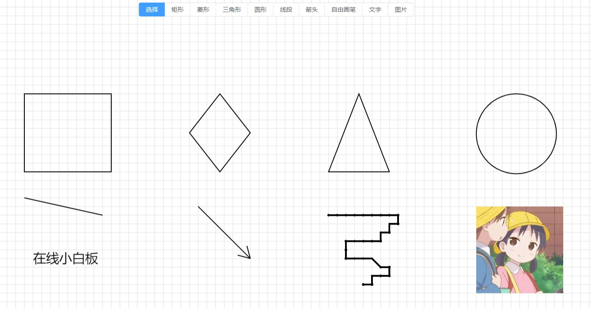

# 一个在线小白板

- [x] 支持绘制矩形、菱形、三角形、圆形、线段、箭头、自由画笔、文字、图片

- [x] 绘制的图形支持拖动、缩放、旋转、编组

- [x] 支持垂直方向无限滚动，一块无限高度的白板

- [x] 支持放大缩小

- [x] 支持样式设置

- [x] 橡皮擦功能

- [x] 支持导入、导出

- [x] 支持前进回退

- [x] 本地存储

- [x] 滚动超出后支持一键回到内容

- [x] 支持多选

- [x] 支持网格模式

- [x] 支持只读模式，只读模式支持随意拖拽

- [x] 支持快捷键

# 相关文章

[我做了一个在线白板！](https://juejin.cn/post/7091276963146530847)

[我做了一个在线白板（二）](https://juejin.cn/post/7129140994011824141)

# 目录简介

1.`/tiny-whiteboard`

在线白板工具库，不依赖任何框架。

2.`/app`

使用`tiny-whiteboard`工具库，基于`vue3.x`、`ElementPlus`搭建的在线`demo`。

# 本地开发

## 开发

```bash
git clone https://github.com/wanglin2/tiny_whiteboard.git
cd tiny_whiteboard

cd tiny-whiteboard
```

将`package.json`文件里的下列字段删除：

```
"main": "./dist/tiny-whiteboard.umd.js",
"module": "./dist/tiny-whiteboard.es.js",
"exports": {
    ".": {
        "import": "./dist/tiny-whiteboard.es.js",
        "require": "./dist/tiny-whiteboard.umd.js"
    }
}
```

替换为：

```
"main": "./src/index.js",
```

然后执行：

```bash
npm i
npm link

cd ..
cd app
npm i
npm link tiny-whiteboard
npm run dev
```

这样修改`tiny-whiteboard`的代码即可实时生效进行调试。

## 打包demo

```bash
cd app
npm run build
```

## 打包tiny-whiteboard

```bash
cd tiny-whiteboard
npm run build
```

即可生成`dist`目录，如果要将包的入口指向打包后的文件，请恢复前面对`package.json`文件做的操作。

# 安装

```bash
npm i tiny-whiteboard
```

# 使用

提供一个宽高不为`0`的且定位不为`static`的容器元素，然后实例化`tiny-whiteboard`。

```js
import TinyWhiteboard from "tiny-whiteboard";

// 创建实例
let app = new TinyWhiteboard({
    container: container
});
// 接下来可以调用实例`app`的各种方法或者监听各种事件。
// 具体可以参考/app项目的示例。
```

# 限制

1.因实现方式原因，元素多了可能会存在性能和卡顿问题，请三思而后用。

2.因元素点击检测实现方式原因，目前不支持贝塞尔曲线或椭圆之类的图形。

# 坐标转换相关

项目内涉及到坐标转换相关的比较复杂和凌乱，如果没有搞清楚很容易迷失。大体上有以下这些：

1.鼠标坐标是相对屏幕的，需要转换成相对容器的，也就是鼠标坐标的`x`、`y`需要减去容器和屏幕左侧及上方的距离。

2.元素的坐标都是相对容器坐标系的，也就是屏幕坐标系，原点在左上角，向右及向下为正方向，而画布的坐标在中心位置，也就是容器的中心点，也是向右及向下为正方向，所以绘制元素时需要把元素坐标转换成画布坐标，具体来说就是元素的`x`、`y`坐标需要容器宽高的`1/2`。

3.画布滚动后，鼠标滚动时只支持垂直方向滚动，只读模式下可以鼠标按住画布进行任意拖动，滚动只是单纯记录一个滚动偏移量`scrollX`和`scrollY`，元素的实际坐标是没有变化的，只是在绘制元素的时候加上了`scrollX`和`scrollY`，向上和向右滚动时`scroll`值为正，向下和向左滚动为负，元素的`x`、`y`坐标需要减去`scrollX`、`scrollY`。

4.画布缩放后，缩放是应用在画布整体上，元素的实际位置和大小是没有变化的，所以当检测位置时鼠标的位置需要反向缩放才能对应到元素的实际坐标，具体来说就是鼠标坐标先转成画布坐标，然后除以缩放值，最后再转换屏幕坐标。

5.当元素旋转后，元素的大小和位置的值是没有变化的，只是通过`rotate`值进行了旋转，所以当通过鼠标位置检测元素时，鼠标的位置需要以元素的中心为旋转中心，反向进行旋转，然后再进行计算。

6.当开启网格时，坐标会和网格对齐，也就是坐标需要对网格的大小取余，然后减去该余数。

# 文档

## 1.实例化

```html
<div id="container"></div>
```

```js
import TinyWhiteboard from "tiny-whiteboard";

// 创建实例
let app = new TinyWhiteboard({
    container: document.getElementById('container')
});
```

### 实例化选项

| 字段名称             | 类型    | 默认值           | 描述                                                         | 是否必填 |
| -------------------- | ------- | ---------------- | ------------------------------------------------------------ | -------- |
| container | Element |                  | 容器元素 | 是 |
| drawType | String  | selection | 当前画布的绘制模式，比如选择模式、矩形绘制模式、自由画笔模式等等 | 否 |
| state | Object  | {} | 画布状态，对象，具体的属性请参考表格1-1 | 否 |

### 表格1-1 画布状态对象state的属性

| 字段名称        | 类型    | 默认值                                         | 描述                                                         |
| --------------- | ------- | ---------------------------------------------- | ------------------------------------------------------------ |
| scale           | Number  | 1                                              | 画布的缩放值，0-1                                            |
| scrollX         | Number  | 0                                              | 画布水平方向的滚动偏移量                                     |
| scrollY         | Number  | 0                                              | 画布垂直方向的滚动偏移量                                     |
| scrollStep      | Number  | 50                                             | 画布滚动步长                                                 |
| backgroundColor | String  |                                                | 画布背景颜色                                                 |
| showGrid        | Boolean | false                                          | 画布是否显示网格                                             |
| readonly        | Boolean | false                                          | 画布是否是只读模式                                           |
| gridConfig      | Object  | {size: 20,strokeStyle: "#dfe0e1",lineWidth: 1} | 画布网格配置，size（网格大小）、strokeStyle（网格线条颜色）、lineWidth（网格线条宽度） |

### 实例属性

| 属性名称  | 类型    | 描述                   |
| --------- | ------- | ---------------------- |
| opts      | Object  | 实例化选项             |
| container | Element | 容器元素               |
| drawType  | String  | 画布当前绘制模式       |
| canvas    | Element | 主画布元素             |
| ctx       | Object  | 主画布元素的绘图上下文 |
| state     | Object  | 画布当前状态           |

### 实例方法

#### `undo()`

回退。

#### `redo()`

前进。

#### `setActiveElementStyle(style)`

为画布当前激活的元素设置样式。

- `style`：样式对象，`object`类型，具体属性请参考表格1-2。

#### 表格1-2 元素样式对象style属性

| 属性名          | 类型   | 默认值                    | 描述                                                |
| --------------- | ------ | ------------------------- | --------------------------------------------------- |
| strokeStyle     | String | \#000000                  | 线条颜色                                            |
| fillStyle       | String | transparent               | *填充颜色*                                          |
| lineWidth       | String | small                     | 线条宽度，small（2px）、middle（4px）、large（6px） |
| lineDash        | Number | 0                         | 线条虚线大小                                        |
| globalAlpha     | Number | 1                         | 透明度                                              |
| fontSize        | Number | 18                        | 字号，文本元素特有样式                              |
| lineHeightRatio | Number | 1.5                       | 行高，文本元素特有样式                              |
| fontFamily      | String | 微软雅黑, Microsoft YaHei | 字体，文本元素特有样式                              |

#### `setSelectedElementStyle(style)`

为当前多选元素设置样式。

- `style`：样式对象，可参考表格1-2。

#### `setCurrentElementsStyle(style)`

为当前激活或选中的元素设置样式。

- `style`：样式对象，可参考表格1-2。

#### `cancelActiveElement()`

移除当前激活元素，即取消当前激活元素的激活状态。

#### `deleteActiveElement()`

从画布中删除当前的激活元素。

#### `deleteCurrentElements()`

从画布中删除当前激活或选中的元素。

#### `copyCurrentElement()`

复制当前激活或选中的元素。只是复制操作，如果需要粘贴需要调用下面的`pasteCurrentElement()`方法。

#### `cutCurrentElement()`

剪切当前激活或选中的元素。只是剪切操作，如果需要粘贴需要调用下面的`pasteCurrentElement()`方法。

#### `pasteCurrentElement(useCurrentEventPos = false)`

粘贴被复制或剪切的元素。

- `useCurrentEventPos`：是否使用鼠标当前的位置，默认为`false`，偏移原图形`20px`，传`true`则粘贴到鼠标当前所在的位置。

#### `copyPasteCurrentElements()`

复制粘贴当前元素。

#### `exportImage(opt)`

导出为图片

- `opt`：导出选项，`Object`，具体属性如下：

  - `opt.type`：导出图片类型，`String`，默认为`image/png`；

  - `opt.renderBg`：是否显示背景，`Boolean`，默认为`true`；

  - `opt.useBlob`：是否以`blob`类型导出，`Boolean`，默认为`DataURL`类型，以`blob`类型导出时函数的返回值是一个`promise`；

  - `opt.paddingX`：绘制的水平内边距，`Number`，默认为`10`像素；

  - `opt.paddingY`：绘制的垂直内边距，`Number`，默认为`10`像素；

  - `opt.onlySelected`：（v0.1.7+）。是否仅导出被选中的元素，`Boolean`，默认为`false`；

#### `exportJson()`

导出为`json`数据。

#### `showGrid()`

显示网格。

#### `hideGrid()`

隐藏网格。

#### `updateGrid(config)`

更新网格配置。

- `config`：配置对象，`Object`，具体配置可参考表格1-1 的`gridConfig`属性。

#### `setEditMode()`

设置为编辑模式。

#### `setReadonlyMode()`

设置为只读模式。

#### `setData(data, noEmitChange)`

设置画布数据，包括状态数据及元素数据。

- `data`：数据，一般是通过调用`getData()`方法获取到的数据进行回填，`Object`，包括以下两个字段：

  - `data.state`：画布状态数据，`Object`，详情请参考表格1-1。
  - `data.elements`：画布上的元素数据，`Array`。

  - `noEmitChange`：禁止触发历史记录收集及`change`事件触发，`Boolean`，默认为`false`，某些场景下需要设置为`true`避免无限循环。

#### `resize()`

当容器的大小变化后需要调用该方法。

#### `updateState(data)`

更新画布状态数据，只是更新状态数据，不会触发重新渲染，如有需要重新渲染或其他操作需要自行调用相关方法。

- `data`： 画布状态，`Object`，详情可参考表格1-1。

#### `updateCurrentType(drawType)`

更新画布当前绘制模式。

- `drawType`：绘制模式，`String`，可选值如下表格所示：

| 值        | 描述                                                         |
| --------- | ------------------------------------------------------------ |
| selection | 选择模式，该模式下可以单击某个元素进行激活元素，或进行多选元素操作 |
| rectangle | 矩形绘制模式                                                 |
| diamond   | 菱形绘制模式                                                 |
| triangle  | 三角形绘制模式                                               |
| circle    | 圆形绘制模式                                                 |
| line      | 线段绘制模式                                                 |
| arrow     | 箭头绘制模式                                                 |
| freedraw  | 自由画笔绘制模式                                             |
| text      | 文字绘制模式                                                 |
| image     | 图片绘制模式                                                 |
| eraser    | 橡皮擦模式                                                   |


#### `deleteElement(element)`

从画布删除某个元素。

#### `copyElement(element, notActive = false, pos)`

复制指定的元素。

- `notActive`：只复制而不激活，`Boolean`，默认为`false`。

- `pos`：是否指定坐标，否则会偏移原位置`20`像素，`Object`，格式为`{x, y}`。

#### `empty()`

清空元素。

#### `zoomIn(num)`

放大。

- `num`：放大值，`Number`，默认为`0.1`。

#### `zoomOut(num)`

缩小。

- `num`：缩小值，`Number`，默认为`0.1`。

#### `setZoom(zoom)`

设置指定缩放值。

- `zoom`：`Number`，`0-1`。

#### `fit()`

缩放移动合适的值以适应所有元素。

#### `setBackgroundColor(color)`

设置背景颜色。

#### `getData()`

获取数据，包括状态数据及元素数据，可进行持久化。

####  `scrollTo(scrollX, scrollY)`

滚动至指定位置。

- `scrollX, scrollY`：滚动距离，`Number`。

#### `scrollToCenter()`

滚动至中心，即定位到所有元素的中心位置。

#### `resetCurrentType()`

复位当前画布绘制模式到选择模式。

#### `selectAll()`

选中所有元素。

#### `on(eventName, callback, context)`

监听事件。事件请见下方表格：

| 事件名称            | 描述                             | 回调参数                                             |
| ------------------- | -------------------------------- | ---------------------------------------------------- |
| zoomChange          | 缩放时触发                       | scale（当前缩放值）                                  |
| scrollChange        | 滚动时触发                       | scrollX（当前水平滚动值）、scrollY（当前垂直滚动值） |
| currentTypeChange   | 绘制模式变化时触发               | drawType（当前绘制模式）                             |
| change              | 画布状态数据变化或元素变化时触发 | data（状态和元素数据）                               |
| shuttle             | 前进后退时触发                   | index（当前指针）、length（当前历史记录数量）        |
| activeElementChange | 激活元素变化事件                 | activeElement（当前激活的元素）                     |
| multiSelectChange   | 多选元素选择完成时触发           | selectedElementList（当前被多选选中的元素）          |
| contextmenu（v0.1.5+）   | 右键菜单事件           | e（事件对象）、elements（当前激活或选中的元素）          |

#### `emit(eventName, ...args)`

触发事件。

#### `off(eventName, callback?)`

解绑事件。

#### `selectAll()`

选中所有元素。

#### `fit()`

缩放以适应所有元素。

#### `updateActiveElementPosition(x, y)`

v0.1.4+。更新当前激活元素的位置。

#### `updateActiveElementSize(width, height)`

v0.1.4+。更新当前激活元素的尺寸。

#### `updateActiveElementRotate(rotate)`

v0.1.4+。更新当前激活元素的旋转角度。

#### `moveUpCurrentElement()`

v0.1.5+。将当前元素上移一层。

#### `moveDownCurrentElement()`

v0.1.5+。将当前元素下移一层。

#### `moveTopCurrentElement()`

v0.1.5+。将当前元素置于顶层。

#### `moveBottomCurrentElement()`

v0.1.5+。将当前元素置于底层。

## 2.elements元素管理实例

可通过`app.elements`获取到该实例。

### 实例属性

| 属性名称          | 类型    | 描述               |
| ----------------- | ------- | ------------------ |
| elementList | Array | 当前画布中的所有元素列表 |
| activeElement    | Object | 当前激活的元素     |
| isCreatingElement | Boolean | 当前是否正在创建新元素 |
| isResizing        | Boolean | 当前是否正在调整元素 |
| resizingElement | Object | 当前正在调整的元素 |

### 实例方法

#### `hasElements()`

当前画布上是否有元素。

#### `getElementsNum()`

v0.1.5+。获取当前画布上的元素数量。

#### `addElement(element)`

添加元素。不会触发渲染，需要手动调用`app.render.render()`方法重新渲染。

#### `unshiftElement(element)`

v0.1.5+。向前添加元素。

#### `insertElement(element, index)`

v0.1.5+。添加元素到指定位置。

#### `getElementIndex(element)`

v0.1.5+。获取元素在元素列表里的索引。

#### `deleteElement(element)`

删除元素。不会触发渲染，需要手动调用`app.render.render()`方法重新渲染。

#### `deleteAllElements()`

删除全部元素。不会触发渲染，需要手动调用`app.render.render()`方法重新渲染。

#### `hasActiveElement()`

是否存在激活元素。

#### `setActiveElement(element)`

替换激活的元素。不会触发渲染，需要手动调用`app.render.render()`方法重新渲染。

#### `cancelActiveElement()`

取消当前激活元素。不会触发渲染，需要手动调用`app.render.render()`方法重新渲染。

#### `createElement(opts = {}, callback = () => {}, ctx = null, notActive)`

创建元素。不会触发渲染，需要手动调用`app.render.render()`方法重新渲染。

- `opts`：创建元素的选项；

- `callback`：回调函数，回调参数：element（创建的元素）；

- `ctx`：回调函数的上下文对象；

- `notActive`：是否不要激活该新创建的元素，默认为`false`；

#### `serialize(stringify)`

序列化当前画布上的所有元素，可用来持久化数据。

- `stringify`：默认为`false`，返回`json`对象类型，传`true`则返回字符串类型。

#### `createElementsFromData(elements = [])`

根据元素数据创建元素，即根据持久化的数据反向创建元素到画布上。不会触发渲染，需要手动调用`app.render.render()`方法重新渲染。


## 3.render渲染类

可通过`app.render`获取到该实例。

该实例的所有方法都已代理到`app`实例上，可以直接通过`app.xxx`调用。


## 4.coordinate坐标转换实例

可通过`app.coordinate`获取到该实例。

### 实例方法

#### `addScrollY(y)`

加上画布当前垂直的滚动距离。

#### `addScrollX(x)`

加上画布当前水平的滚动距离。

#### `subScrollY(y)`

减去画布当前垂直的滚动距离。

#### `subScrollX(x)`

减去画布当前水平的滚动距离。

#### `transformToCanvasCoordinate(x, y)`

屏幕坐标转换成画布坐标。

#### `transformToScreenCoordinate(x, y)`

画布转换转屏幕坐标。

#### `transform(x, y)`

综合转换，屏幕坐标转画布坐标，再减去滚动值。

#### `windowToContainer(x, y)`

相对窗口的坐标转换成相对容器的，用于当容器非全屏的时候。

#### `containerToWindow(x, y)`

相对容器的坐标转换成相对窗口的，用于当容器非全屏的时候。

#### `scale(x, y)`

屏幕坐标在应用画布缩放后的位置。

#### `reverseScale(x, y)`

屏幕坐标在反向应用画布缩放后的位置。

#### `gridAdsorbent(x, y)`

网格吸附。


## 5.event事件实例

可通过`app.event`获取该实例。

### 实例方法

#### `on(eventName, callback, context)`

监听事件。事件请见下方表格：

| 事件名称   | 描述         | 回调参数                                  |
| ---------- | ------------ | ----------------------------------------- |
| mousedown  | 鼠标按下事件 | e、事件实例对象event                      |
| mousemove  | 鼠标移动事件 | e、事件实例对象event                      |
| mouseup    | 鼠标松开事件 | e、事件实例对象event                      |
| dblclick   | 双击事件     | e、事件实例对象event                      |
| mousewheel | 鼠标滚动事件 | dir（滚动方向，down代表向下，up代表向上） |
| keydown    | 按键按下事件 | e（原始事件对象）、事件实例对象event      |
| keyup      | 按键松开事件 | e（原始事件对象）、事件实例对象event      |

- `e`：事件对象，非原始事件对象，为处理后的事件对象，格式如下：

  ```js
  {
        originEvent: e,// 原始事件对象
        unGridClientX,
        unGridClientY,
        clientX,
        clientY
  }
  ```

  `clientX`和`clientY`是经过了一系列转换的：

  >1.将相当于浏览器窗口左上角的坐标转换成相对容器左上角
  >
  >2.如果画布进行了缩放，那么鼠标坐标要反向进行缩放
  >
  >3.`x`、`y`坐标加上了画布水平和垂直的滚动距离`scrollX`和`scrollY`
  >
  >4.如果开启了网格，那么坐标要吸附到网格上

  `unGridClientX`、`unGridClientY`和`clientX`、`clientY`的区别是没有经过第四步的处理。用于位置检测等不需要吸附的场景。

  对于第三步来说，向下滚动`scroll`值为正，而`canvas`坐标系向下为正，所以要造成元素向上滚动的效果显示的时候元素的y坐标需要减去`scroll`值，但是元素真实的y值并未改变，所以对于鼠标坐标来说需要加上`scroll`值，这样才能匹配元素真实的`y`坐标，水平方向也是一样的。

- `event`：事件类的实例对象，存在以下属性：

  | 属性名称      | 类型    | 描述                                                     |
  | ------------- | ------- | -------------------------------------------------------- |
  | isMousedown   | Boolean | 鼠标是否按下                                             |
  | mousedownPos  | Object  | 按下时的鼠标位置，格式见下方。                           |
  | mouseOffset   | Object  | 鼠标当前位置和按下时位置的差值，格式见下方。             |
  | lastMousePos  | Object  | 记录上一时刻的鼠标位置，格式为`{x, y}`，经过处理的坐标。 |
  | mouseDistance | Number  | 前一瞬间的鼠标移动距离。                                 |
  | lastMouseTime | Number  | 记录上一时刻的时间，时间戳格式。                         |
  | mouseDuration | Number  | 前一瞬间经过的时间，单位为毫秒。                         |
  | mouseSpeed    | Number  | 前一瞬间的鼠标移动速度，单位为px/ms。                    |

  - `mousedownPos`属性格式：

    ```js
    {
          x: 0,// 经过了以上4步转换后的坐标
          y: 0,
          unGridClientX: 0,// 经过了除第4步的坐标
          unGridClientY: 0,
          originClientX: 0,// 原始没有经过任何处理的坐标
          originClientY: 0
    }
    ```

  - `mouseOffset`属性格式：

    ```js
    {
          x: 0,// 经过了以上4步转换后的坐标差数据
          y: 0,
          originX: 0,// 原始没有经过任何处理的坐标差数据
          originY: 0
    }
    ```

#### `emit(eventName, ...args)`

触发事件。

#### `off(eventName, callback?)`

解绑事件。


## 6.cursor鼠标样式实例

可通过`app.cursor`获取该实例。

### 实例方法

#### `set(type = "default")`

设置鼠标指针样式。

#### `hide()`

隐藏鼠标指针。

#### `reset()`

复位鼠标指针。

#### `setCrosshair()`

设置为 ✚ 字型。

#### `setMove()`

设置为 可移动 状态。

#### `setEraser()`

设置为橡皮擦样式。


## 7.history历史记录管理实例

可通过`app.history`获取该实例。

### 实例方法

#### `undo()`

后退。

#### `redo()`

前进。

#### `add(data)`

添加一个历史记录数据，`data`一般是通过`app.getData()`获取到的数据。

#### `clear()`

清空历史记录数据。


## 8.export导入导出实例

可通过`app.export`获取该实例。

### 实例方法

#### `exportImage(opt)`

导出为图片，参数详见前面的文档。

#### `exportJson()`

导出为`json`数据。


## 9.background背景设置实例

可通过`app.background`获取该实例。

### 实例方法

#### `addBackgroundColor()`

添加背景颜色，背景色值为`app.state.backgroundColor`。

#### `remove()`

移除背景。

#### `canvasAddBackgroundColor(ctx, width, height, backgroundColor)`

给一个`canvas`设置背景颜色，非`css`样式。

- `ctx`：`canvas`绘图上下文。


## 10.selection多选实例

可通过`app.selection`获取该实例。

### 实例方法

#### `selectElements(elements = [])`

选中指定元素。

#### `copySelectionElements(pos)`

复制粘贴当前选中的元素。

- `pos`：是否指定粘贴的坐标，否则会偏移原位置`20`像素，`Object`，格式为`{x, y}`。

#### `getSelectionElements()`

获取当前被选中的元素。

#### `hasSelectionElements()`

当前是否存在被选中元素。

#### `deleteSelectedElements()`

从画布删除当前选中的元素。

#### `setSelectedElementStyle(style)`

为当前选中的元素设置样式。


## 11.mode模式实例

可通过`app.mode`获取该实例。

### 实例方法

#### `setEditMode()`

设置为编辑模式。

#### `setReadonlyMode()`

设置为只读模式。


## 12.imageEdit图片选择实例

可通过`app.imageEdit`获取该实例。


## 13.textEdit文字编辑实例

可通过`app.textEdit`获取该实例。


## 14.keyCommand快捷键实例

可通过`app.keyCommand`获取该实例。

### 实例属性

| 属性名称 | 类型   | 描述                        |
| -------- | ------ | --------------------------- |
| keyMap   | Object | 按键的名称到`keyCode`映射。 |

### 实例方法

#### `bindEvent()`

绑定`keydown`事件。

#### `unBindEvent()`

解绑`keydown`事件。如果你的事件会和快捷键冲突，那么可以暂时调用该方法解绑快捷键的`keydown`事件。

#### `addShortcut(key, fn, ctx)`

添加快捷键命令。

- `key`：快捷键，允许三种组合方式：单个按键（如`Enter`）、或（`Tab | Insert`）、与（`Shift + a`），具体的按键名称可以`app.keyCommand.keyMap`查看。

- `fn`：快捷键对应的执行函数。

- `ctx`：函数的上下文。

#### `removeShortcut(key, fn)`

移除快捷键命令。


## 15.工具方法

可以通过如下方式获取到内置的工具方法：

```js
import TinyWhiteboard from "tiny-whiteboard";

TinyWhiteboard.utils.xxx
```

### `createCanvas(width,height,opt = { noStyle: false, noTranslate: false, className: '' })`

创建`canvas`元素。

- `width`：宽度

- `height`：高度

- `opt`：选项
  - `opt.noStyle`：是否不需要设置样式，如果需要的话，那么会给`canvas`元素加上`left=0`和`top=0`的绝对定位样式；
  - `noTranslate`：是否不需要将画布原点移动到画布中心；
  - `className`：添加到画布元素上的类名；

### `getTowPointDistance(x1, y1, x2, y2)`

计算两点之间的距离。

### `getPointToLineDistance(x, y, x1, y1, x2, y2)`

计算点到直线的距离。

### `checkIsAtSegment(x, y, x1, y1, x2, y2, dis = 10)`

检查是否点击到了一条线段。

- `dis`：点距离线段多少距离内都认为是点击到了；

### `radToDeg(rad)`

弧度转角度。

### `degToRad(deg)`

角度转弧度。

### `getTowPointRotate(cx, cy, tx, ty, fx, fy)`

计算中心点相同的两个坐标相差的角度数。

### `getRotatedPoint(x, y, cx, cy, rotate)`

获取坐标经指定中心点旋转指定角度的坐标，顺时针还是逆时针`rotate`传正负即可。

### `getElementCenterPoint(element)`

获取元素的中心点坐标。

- `element`：元素，`Object`，必要的字段如为`{ x, y, width, height }`；

### `getElementCornerPoint(element, dir)`

获取元素的四个角坐标。

- `element`：元素，`Object`，必要的字段如为`{ x, y, width, height }`；

- `dir`：要获取的哪个角，可选项为：`topLeft`、`topRight`、`bottomRight`、`bottomLeft`；

### `getElementRotatedCornerPoint(element, dir)`

获取元素旋转后的四个角坐标。参数同上。

### `checkPointIsInRectangle(x, y, rx, ry, rw, rh)`

判断一个坐标是否在一个矩形内。第三个参数可以直接传一个带有`x`、`y`、`width`、`height`属性的元素对象。

### `getBoundingRect(pointArr = [], returnCorners = false)`

获取多个点的外包围框。

返回数据：

```js
{
  x,
  y,
  width,
  height,
}
```

- `pointArr`：点数组，数组的每一项的格式为：`[x, y]`；

- `returnCorners`：v0.1.4+。以四个角坐标的形式返回：

```js
[
  [x0, y0],
  [x1, y1],
  [x2, y2],
  [x3, y3],
]
```

### `deepCopy(obj)`

简单深拷贝，只能用于拷贝纯粹的对象。

### `getFontString(fontSize, fontFamily)`

拼接`canvas`文字字体字号字符串。

### `splitTextLines(text)`

将文本切割成行，返回一个数组。

### `getTextActWidth(text, style)`

计算文本的实际渲染宽度。

- `style`：对象类型，包含`fontSize`和`fontFamily`两个属性；

### `getWrapTextMaxRowTextNumber(text)`

计算换行文本的最长一行的文字数量。

### `throttle(fn, ctx, time = 100)`

节流函数。

### `downloadFile(file, fileName)`

下载文件。

### `getElementCorners(element)`

获取元素的四个角的坐标，应用了旋转之后的，返回一个数组。

### `getMultiElementRectInfo(elementList = [])`

获取多个元素的最外层包围框信息。返回`{minx,maxx,miny,maxy};`

#### `createImageObj(url)`

创建图片对象，即`new Image()`的图片对象，返回`promise`。


## 16.图形绘制工具方法

可以通过如下方式获取到内置的图形绘制工具方法：

```js
import TinyWhiteboard from "tiny-whiteboard";

TinyWhiteboard.draw.xxx
```

### `drawRect(ctx, x, y, width, height, fill = false)`

绘制矩形。

- `ctx`：`canvas`绘图上下文。

- `fill`：是否进行填充。

### `drawDiamond(ctx, x, y, width, height, fill = false)`

绘制菱形。

### `drawTriangle(ctx, x, y, width, height, fill = false)`

绘制三角形。

### `drawCircle(ctx, x, y, r, fill = false)`

绘制圆形。

### `drawLine(ctx, points)`

绘制折线。

- `points`：折线的端点列表。`Array`，数组的每一项为`[x, y]`。

### `drawArrow(ctx, pointArr)`

绘制箭头。

`pointArr`：箭头的首尾两个顶点坐标，`Array`，数组的每一项为`[x, y]`。

### `drawLineSegment(ctx, mx, my, tx, ty, lineWidth = 0)`

绘制线段。

- `lineWidth`：线宽

### `drawText(ctx, textObj, x, y)`

绘制文字。

- `textObj`：文本数据，`Object`，字段如下：
  - `textObj.text`：文本字符串；
  - `textObj.style`：文本属性，`Object`，需包含三个字段：`fontSize`、`fontFamily`、`lineHeightRatio（行高，需为数字类型，比如1.5，代表行高1.5倍）`；

### `drawImage(ctx, element, x, y, width, height)`

绘制图片。

`element`：图片数据，`Object`，字段如下：

`element.ratio`：图片的长宽比；

`element.imageObj`：要绘制到`canvas`上的图片对象或其他能被`canvas`绘制的对象；


## 17.图形点击检测工具方法

可以通过如下方式获取到内置的图形点击检测工具方法：

```js
import TinyWhiteboard from "tiny-whiteboard";

TinyWhiteboard.checkHit.xxx
```

### `checkIsAtMultiSegment(segments, rp)`

检测是否点击到折线上。

- `segments`：折线的端点数组，`Array`，数组的每一项为`[fx, fy, tx, ty]`，即线段的首尾两个坐标；

- `rp`：要检测的点，格式为`{x, y}`；

### `checkIsAtRectangleEdge(element, rp)`

检测是否点击到矩形边缘。

- `element`：`Object`，需包含字段`{ x, y, width, height }`

### `checkIsAtRectangleInner(element, rp)`

检测是否点击到矩形内部。

### `checkIsAtCircleEdge(element, rp)`

检测是否点击到圆的边缘，圆的半径为`width`和`height`中的较小值的一半。

### `checkIsAtLineEdge(element, rp)`

检测是否点击到线段边缘。

- `element`：`Object`，格式如下：

```js
{
    pointArr: [
        [x, y],
        ...
    ]
}
```

### `checkIsAtFreedrawLineEdge(element, rp)`

检测是否点击到自由画笔图形边缘。`element`字段同上。

### `checkIsAtDiamondEdge(element, rp)`

检测是否点击到菱形边缘。

- `element`：`Object`，需包含字段`{ x, y, width, height }`

### `checkIsAtTriangleEdge(element, rp)`

检测是否点击到三角形边缘。

- `element`：`Object`，需包含字段`{ x, y, width, height }`

### `checkIsAtArrowEdge(element, rp)`

检测是否点击到箭头边缘。

- `element`：`Object`，格式如下：

```js
{
    pointArr: [
        [x1, y1],
        [x2, y2]
    ]
}
```


## 18.内置元素类

可以通过以下方式获取到某个元素类：

```js
import TinyWhiteboard from "tiny-whiteboard";

TinyWhiteboard.elements.xxx
```

目前存在以下元素类：

| 类名                  | 简介                                                         |
| --------------------- | ------------------------------------------------------------ |
| BaseElement           | 基础元素类，不用来实例化                                     |
| Arrow                 | 箭头元素类，继承自`BaseElement`                              |
| Circle                | 正圆元素类，继承自`BaseElement`                              |
| Diamond               | 菱形元素类，继承自`BaseElement`                              |
| Image                 | 图片元素类，继承自`BaseElement`                              |
| Rectangle             | 矩形元素类，继承自`BaseElement`                              |
| Text                  | 文本元素类，继承自`BaseElement`                              |
| Triangle              | 三角形元素类，继承自`BaseElement`                            |
| BaseMultiPointElement | 由多个坐标组成的元素的基础类，继承自`BaseElement`，不用来实例化 |
| Freedraw              | 自由画笔元素类，继承自`BaseMultiPointElement`                |
| Line                  | 线段/折线元素类，继承自`BaseMultiPointElement`               |
| DragElement           | 拖拽元素类，继承自`BaseElement`，每个元素都会实例化一个该类，用来当元素激活时显示拖拽框及进行元素调整操作 |
| MultiSelectElement    | 用于多选情况下的虚拟元素类，继承自`BaseElement`              |

### 基础元素实例属性

| 属性名称      | 类型    | 描述                                                         |
| ------------- | ------- | ------------------------------------------------------------ |
| type          | String  | 元素类型                                                     |
| isActive      | Boolean | 是否被激活                                                   |
| isSelected    | Boolean | 是否被多选选中                                               |
| x、y          | Number  | 元素的位置                                                   |
| width、height | Number  | 元素的宽高                                                   |
| rotate        | Number  | 元素的旋转角度                                               |
| style         | Object  | 元素的样式对象                                               |
| pointArr      | Array   | 由多个点组成的元素（Arrow、Line、Freedraw）的特有属性。组成元素的点坐标数组。 |

### 基础元素实例方法

#### `on(eventName, callback, context)`

v0.1.4+。监听元素事件。事件请见下方表格：

| 事件名称            | 描述                             | 回调参数                                             |
| ------------------- | -------------------------------- | ---------------------------------------------------- |
| elementPositionChange   | 元素x、y坐标发生变化时触发          | x、y                                  |
| elementSizeChange       | 元素width、height大小发生变化时触发 | width、height                         |
| elementRotateChange     | 元素rotate旋转角度发生变化时触发    | rotate                                |

#### serialize()

序列化元素，返回的数据可用于进行持久化及回显。

#### render()

渲染元素。

#### setStyle(style = {})

设置元素的绘图样式。

#### move(ox, oy)

移动元素，在元素当前的位置上累加`ox`、`oy`。

#### updatePos(x, y)

更新元素的位置。

#### updateSize(width, height)

更新元素的宽高。

#### updateRect(x, y, width, height)

更新元素的位置及宽高。

#### offsetRotate(or)

旋转元素，在元素当前的旋转角度上累加`or`角度。

#### rotateByCenter(rotate, cx, cy)

根据指定中心点旋转元素的各个点。对于由多个点坐标组成的元素来说是修改其`pointArr`坐标，对于其他元素来说是修改其`x、y`坐标。

#### isHit(x, y)

检测该坐标是否能击中该元素。

#### getEndpointList()

v0.1.4+。获取图形应用了旋转之后的端点列表。可用于计算元素的外包围框数据。

# License

[MIT](https://opensource.org/licenses/MIT)
